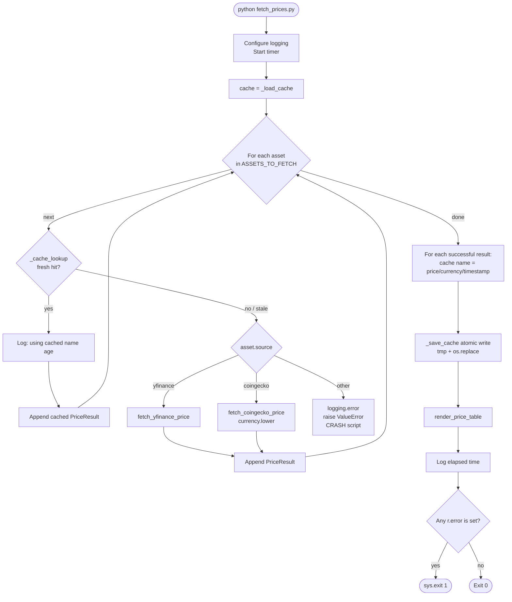
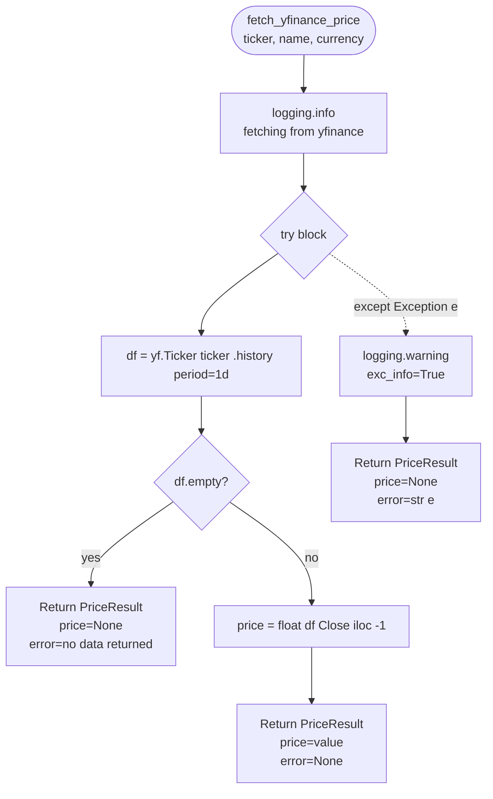
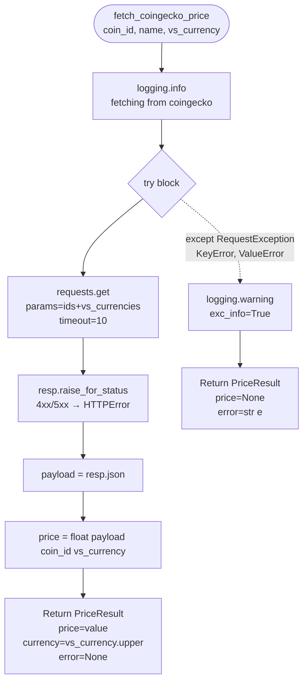
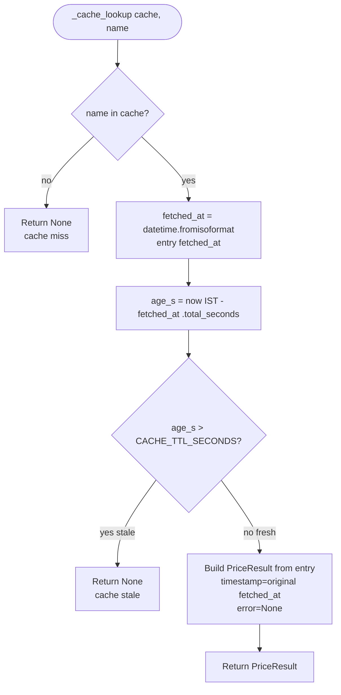
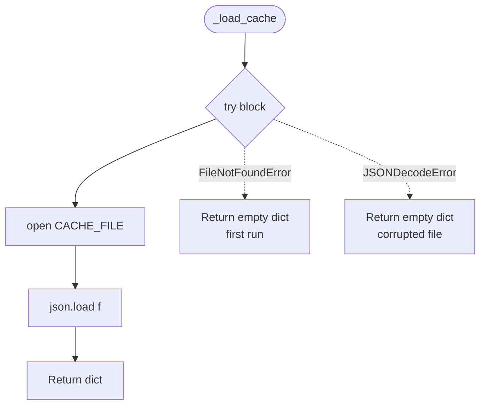

# Task 2 — Live Market Data Fetch: Design

**Status:** Approved 2026-05-02
**Source spec:** `task2_market/task2_instruction.md` (authoritative — this design is the implementation plan that interprets it)
**Scope:** Base task + bonus 1 (60-second TTL JSON cache) + bonus 4 (exit code 1 on any fetch failure). Bonuses 2 (`--watch`) and 3 (INR conversion column) are deferred.
**Asset selection:** `^NSEI` (NIFTY 50, INR) + `RELIANCE.NS` (INR) + `bitcoin` (USD) — covers index + individual equity + crypto via two distinct sources.

---

## 1. Architecture & file layout

```
task2_market/
├── fetch_prices.py        # ~200 lines — dataclass, cache helpers, fetchers, renderer, main
├── test_fetch_prices.py   # ~120 lines — error-path + cache mocks, plain assert
└── README.md              # task-specific: summary, run, design notes, AI usage

# Repo root (modified)
requirements.txt           # appended: yfinance>=0.2.40, requests>=2.31.0, rich>=13.7.0
README.md                  # update Task 2 link from "(TBD)" to "(see task2_market/)"
.gitignore                 # add: task2_market/.price_cache*
```

`fetch_prices.py` top-to-bottom order:

1. Module docstring (1 line) + `from __future__ import annotations`.
2. Imports — stdlib first (`json`, `logging`, `sys`, `time`, `dataclasses`, `datetime`, `pathlib`, `zoneinfo`), third-party second (`requests`, `yfinance as yf`, `rich.console`, `rich.table`).
3. Module constants:
   - `COINGECKO_BASE_URL = "https://api.coingecko.com/api/v3/simple/price"`
   - `REQUEST_TIMEOUT_SECONDS = 10`
   - `IST = ZoneInfo("Asia/Kolkata")`
   - `CACHE_FILE = Path(__file__).parent / ".price_cache.json"`
   - `CACHE_TTL_SECONDS = 60`
   - `ASSETS_TO_FETCH` (3-asset config below).
4. `@dataclass class PriceResult` — exact spec shape: `name`, `price: float | None`, `currency`, `timestamp: datetime`, `error: str | None = None`.
5. Cache helpers (in this order): `_load_cache`, `_cache_lookup`, `_save_cache`.
6. Tiny helper `_now_ist() -> datetime` returning `datetime.now(IST)` (used by both fetchers and the renderer).
7. `fetch_yfinance_price(ticker, display_name, currency) -> PriceResult`.
8. `fetch_coingecko_price(coin_id, display_name, vs_currency="usd") -> PriceResult`.
9. `render_price_table(results: list[PriceResult]) -> None`.
10. `main() -> None`.
11. `if __name__ == "__main__": main()`.

`ASSETS_TO_FETCH`:
```python
ASSETS_TO_FETCH = [
    {"source": "yfinance",  "ticker": "^NSEI",       "name": "NIFTY50",  "currency": "INR"},
    {"source": "yfinance",  "ticker": "RELIANCE.NS", "name": "RELIANCE", "currency": "INR"},
    {"source": "coingecko", "ticker": "bitcoin",     "name": "BTC",      "currency": "USD"},
]
```

No `__init__.py` — script-style, sibling import in tests like Task 1.

## 2. Cache helpers (bonus 1)

Cache lives in `task2_market/.price_cache.json`, gitignored. Schema is a flat dict keyed by display name:

```json
{
  "NIFTY50":  {"price": 22541.80, "currency": "INR", "fetched_at": "2026-05-02T14:32:15.123456+05:30"},
  "RELIANCE": {"price":  1234.56, "currency": "INR", "fetched_at": "2026-05-02T14:32:16.234567+05:30"},
  "BTC":      {"price": 62341.20, "currency": "USD", "fetched_at": "2026-05-02T14:32:17.345678+05:30"}
}
```

```python
def _load_cache() -> dict:
    """Return cache dict, or {} on missing/corrupted file."""
    try:
        with CACHE_FILE.open() as f:
            return json.load(f)
    except (FileNotFoundError, json.JSONDecodeError):
        return {}


def _cache_lookup(cache: dict, name: str) -> PriceResult | None:
    entry = cache.get(name)
    if not entry:
        return None
    fetched_at = datetime.fromisoformat(entry["fetched_at"])
    age = (datetime.now(IST) - fetched_at).total_seconds()
    if age > CACHE_TTL_SECONDS:
        return None
    return PriceResult(
        name=name,
        price=entry["price"],
        currency=entry["currency"],
        timestamp=fetched_at,
    )


def _save_cache(cache: dict) -> None:
    """Atomic write via temp + rename."""
    tmp = CACHE_FILE.with_suffix(".json.tmp")
    with tmp.open("w") as f:
        json.dump(cache, f, indent=2)
    tmp.replace(CACHE_FILE)
```

**Cache semantics:**
- Cache lives at the `main()` layer — fetchers stay pure (matches spec's required signatures).
- Only **successful** fetches are cached. Failures are never written, so a transient outage doesn't lock in `FETCH FAILED` for 60s.
- Stale entries are **kept on disk** (we merge on save, don't replace). They're harmless — next lookup re-fetches.
- Corrupted cache file ⇒ empty cache, no crash.
- Atomic write via `.tmp` + `os.replace` prevents partial-write corruption on Ctrl-C mid-save.
- Cache-hit `PriceResult.timestamp` carries the **original fetch time**, so the table header reflects data freshness, not run time.

## 3. Fetcher functions

### `fetch_yfinance_price(ticker, display_name, currency) -> PriceResult`

```
1. logging.info(f"fetching {display_name} from yfinance ({ticker})")
2. try:
3.     df = yf.Ticker(ticker).history(period="1d")
4.     if df.empty:
5.         return PriceResult(name=display_name, price=None, currency=currency,
6.                            timestamp=_now_ist(), error="no data returned for ticker")
7.     price = float(df["Close"].iloc[-1])
8.     return PriceResult(name=display_name, price=price, currency=currency, timestamp=_now_ist())
9. except Exception as e:
10.    logging.warning(f"{display_name}: yfinance fetch failed", exc_info=True)
11.    return PriceResult(name=display_name, price=None, currency=currency,
12.                       timestamp=_now_ist(), error=str(e))
```

**Why broad `except Exception`:** yfinance's exception surface is wide and version-dependent (network errors, parser errors, missing-symbol errors all bubble up as different types). Spec's anti-pattern note explicitly allows broad except at the orchestration boundary; this is that boundary for yfinance.

### `fetch_coingecko_price(coin_id, display_name, vs_currency="usd") -> PriceResult`

```
1. logging.info(f"fetching {display_name} from coingecko ({coin_id}/{vs_currency})")
2. try:
3.     resp = requests.get(
4.         COINGECKO_BASE_URL,
5.         params={"ids": coin_id, "vs_currencies": vs_currency},
6.         timeout=REQUEST_TIMEOUT_SECONDS,
7.     )
8.     resp.raise_for_status()                          # 4xx/5xx → HTTPError (RequestException subclass)
9.     payload = resp.json()
10.    price = float(payload[coin_id][vs_currency])     # KeyError on schema mismatch
11.    return PriceResult(name=display_name, price=price, currency=vs_currency.upper(),
12.                       timestamp=_now_ist())
13. except (requests.RequestException, KeyError, ValueError) as e:
14.    logging.warning(f"{display_name}: coingecko fetch failed", exc_info=True)
15.    return PriceResult(name=display_name, price=None, currency=vs_currency.upper(),
16.                       timestamp=_now_ist(), error=str(e))
```

**Why narrow `except`:** `requests` and JSON parsing have a well-defined exception surface. Catch only what we know. `RequestException` covers network/timeout/HTTP errors; `KeyError` covers schema mismatches; `ValueError` covers bad JSON or non-numeric prices.

**Subtleties:**
- **`vs_currency` casing** — CoinGecko expects lowercase (`usd`); display uses uppercase (`USD`). Caller passes `"USD"` in the asset config; `main()` lowercases before calling the fetcher; the fetcher uppercases for the result.
- **`raise_for_status()`** — without it, a 429 (rate limit) or 503 returns a 200-shaped object that fails on `payload[coin_id]` with a confusing `KeyError`. With it, those become `HTTPError` (caught cleanly).
- **`PriceResult.timestamp`** is captured per-asset, not at script start, per spec.

## 4. `main()` orchestration

```
1. logging.basicConfig(level=logging.INFO, format="%(asctime)s [%(levelname)s] %(message)s")
2. start = time.monotonic()
3. cache = _load_cache()
4.
5. results: list[PriceResult] = []
6. for asset in ASSETS_TO_FETCH:
7.     hit = _cache_lookup(cache, asset["name"])
8.     if hit is not None:
9.         age = (datetime.now(IST) - hit.timestamp).total_seconds()
10.        logging.info(f"using cached {asset['name']} ({age:.0f}s old)")
11.        results.append(hit)
12.        continue
13.    if asset["source"] == "yfinance":
14.        r = fetch_yfinance_price(asset["ticker"], asset["name"], asset["currency"])
15.    elif asset["source"] == "coingecko":
16.        r = fetch_coingecko_price(asset["ticker"], asset["name"], asset["currency"].lower())
17.    else:
18.        logging.error(
19.            f"unknown source in ASSETS_TO_FETCH: {asset['source']!r} "
20.            f"(asset name={asset['name']!r}). Code bug — fix the config or add a fetcher."
21.        )
22.        raise ValueError(f"unknown source: {asset['source']}")
23.    results.append(r)
24.
25. for r in results:                                # persist successful fetches
26.    if r.error is None:
27.        cache[r.name] = {
28.            "price": r.price,
29.            "currency": r.currency,
30.            "fetched_at": r.timestamp.isoformat(),
31.        }
32. _save_cache(cache)
33.
34. render_price_table(results)
35.
36. elapsed = time.monotonic() - start
37. logging.info(f"fetched {len(results)} assets in {elapsed:.2f}s")
38.
39. if any(r.error for r in results):
40.    sys.exit(1)
```

### Error-handling matrix

| What goes wrong | Where it's caught | What happens |
|---|---|---|
| yfinance error (any exception) | `fetch_yfinance_price` (`except Exception`) | Row → `FETCH FAILED`. Other rows continue. WARNING logged. Not cached. |
| CoinGecko network failure / 4xx / 5xx | `fetch_coingecko_price` (`except RequestException`) | Same. |
| CoinGecko schema mismatch / bad JSON | `fetch_coingecko_price` (`except KeyError, ValueError`) | Same. |
| Unknown `source` in `ASSETS_TO_FETCH` | `main()` `else` branch | `logging.error(...)` then `raise ValueError`. **Crashes** — code bug, surfaced loudly. |
| Cache file corrupted | `_load_cache` (`except JSONDecodeError`) | Silently treated as empty cache. |
| Cache file missing | `_load_cache` (`except FileNotFoundError`) | Silently treated as empty cache. |
| Ctrl-C mid-save | `os.replace` is atomic | `.tmp` may exist; `.json` is either old-good or new-good, never partial. |
| Bad timestamp / `ZoneInfo` missing | not caught | Crashes. tzdata is stdlib; "should never happen". |
| User Ctrl-C | not caught | `KeyboardInterrupt` propagates, exits non-zero. Standard. |

**Exit code logic (bonus 4):** `sys.exit(1)` placed *after* `render_price_table` so the table still prints even when failures occurred.

**No retries, no async, no CLI args.** Sequential 3 calls finish in ~3-5s; `argparse` for a no-flag script is overhead.

## 5. Code flow diagrams

GitHub renders mermaid natively. Diagrams visualise the prose in sections 2–4.

### 5.1 `main()` orchestration



### 5.2 `fetch_yfinance_price` flow



### 5.3 `fetch_coingecko_price` flow



### 5.4 `_cache_lookup` decision logic



### 5.5 `_load_cache` corruption handling



## 6. Table rendering

```
1. console = Console()
2. ts = next((r.timestamp for r in results if r.error is None), _now_ist())
3. header = f"Asset Prices — fetched at {ts.strftime('%Y-%m-%d %H:%M:%S')} IST"
4.
5. table = Table(title=header)
6. table.add_column("Asset")
7. table.add_column("Price", justify="right")
8. table.add_column("Currency")
9.
10. for r in results:
11.     if r.error is None:
12.         price_cell = f"{r.price:,.2f}"
13.     else:
14.         price_cell = "[red]FETCH FAILED[/red]"
15.     table.add_row(r.name, price_cell, r.currency)
16.
17. console.print(table)
```

- Header timestamp comes from the **first successful** result, falling back to `_now_ist()` if every fetch failed. With cache hits, this naturally reflects data freshness.
- Failure cells use rich's inline markup `[red]FETCH FAILED[/red]`.
- Currency column shown unconditionally (we always know the *intended* currency from the config).
- Price column right-justified for decimal alignment.
- Number formatting: `f"{price:,.2f}"` per spec.

## 7. Test plan — `test_fetch_prices.py`

Stdlib + `unittest.mock`, plain `assert`. Sibling import like Task 1.

**Imports:**
```python
import sys
import tempfile
from datetime import datetime, timedelta
from pathlib import Path
from unittest.mock import patch, Mock

import requests

sys.path.insert(0, str(Path(__file__).parent))
from fetch_prices import (
    IST,
    fetch_yfinance_price,
    fetch_coingecko_price,
    _cache_lookup,
    _load_cache,
)
```

**Tests (8, error-path + cache only):**

| # | Name | What's mocked | Asserts |
|---|---|---|---|
| 1 | `test_yfinance_empty_dataframe` | `fetch_prices.yf.Ticker` returns object whose `.history()` returns `Mock(empty=True)` | `result.price is None`, `"no data" in result.error.lower()` |
| 2 | `test_yfinance_raises_exception` | `fetch_prices.yf.Ticker` raises `Exception("simulated network failure")` | `result.price is None`, `result.error` non-empty |
| 3 | `test_coingecko_request_exception` | `fetch_prices.requests.get` raises `requests.RequestException("connection refused")` | `result.price is None`, `result.error` non-empty |
| 4 | `test_coingecko_bad_schema` | `fetch_prices.requests.get` returns Mock whose `.json()` returns `{"unexpected": "shape"}` and `.raise_for_status()` is a no-op | `result.price is None`, `result.error` non-empty |
| 5 | `test_coingecko_timeout_is_set` | `fetch_prices.requests.get` returns valid-shape Mock; capture call kwargs | `mock_get.call_args.kwargs["timeout"] == 10` |
| 6 | `test_cache_lookup_fresh_hit` | Pass an in-memory `cache` dict with a fresh-timestamp entry to `_cache_lookup` | Returns a `PriceResult` whose `price` matches the cached value |
| 7 | `test_cache_lookup_stale_miss` | Same pattern, timestamp set to 120s ago | Returns `None` |
| 8 | `test_load_cache_corrupted_returns_empty` | Write `"not valid json {{{"` to a tempfile; `patch` `fetch_prices.CACHE_FILE` to point at it | `_load_cache()` returns `{}` |

**Runner block** at bottom mirrors Task 1's pattern.

**What the tests deliberately do NOT cover:**
- Happy-path live network calls — manual acceptance tests handle this per spec.
- `main()` orchestration — implicitly covered by per-fetcher and cache-helper tests.
- `render_price_table` output — visual; brittle to unit-test.
- `_save_cache` atomic write — would test `os.replace`, which is a stdlib guarantee.
- Logging output — implementation detail.

## 8. Workflow, README, and how this lands in git

### Branching & commit sequence

1. From clean `main` (currently at `c2f5231`): `git checkout -b task2/market-fetch`
2. Implement → test → write per-task README → commit on the branch.
3. Push, open PR, ask user for review.
4. On approval: `gh pr merge 2 --merge --delete-branch`, then `git fetch --prune` locally.

**Two commits on the feature branch:**
- `task2: implement live market data fetcher with cache and mocked tests` (`fetch_prices.py` + `test_fetch_prices.py` + `requirements.txt` update + `.gitignore` cache pattern)
- `task2: add per-task README and update root README link` (the two README files)

### `task2_market/README.md` outline

```
# Task 2 — Live Market Data Fetch

## Summary
2-3 sentences: what fetch_prices.py does, the 3 assets it fetches
(NIFTY50, RELIANCE, BTC), how it degrades when an API fails,
60-second local JSON cache.

## Run
pip install -r requirements.txt
python task2_market/fetch_prices.py        # rich table + INFO logs to stderr
python task2_market/test_fetch_prices.py   # 8 mocked tests

# To force fresh fetches (bypass cache):
rm task2_market/.price_cache.json

## Manual acceptance tests (per spec)
- Bad ticker: change ^NSEI to ^NOTAREALTICKER in ASSETS_TO_FETCH, re-run.
  NIFTY50 row shows "FETCH FAILED"; other rows still render.
- Offline: disable wifi, re-run. All 3 rows show "FETCH FAILED";
  WARNING logs appear; exit code is 1.

## Design notes
- Approach 1 (if/elif dispatcher in main) — see design doc.
- yfinance: broad except Exception (sprawling exception surface).
- CoinGecko: narrow except (RequestException, KeyError, ValueError).
- Asset list in ASSETS_TO_FETCH constant — adding an asset is a one-line edit.
- Logging to stderr only; no log file.
- Cache: 60-second TTL JSON file at task2_market/.price_cache.json (gitignored).
  Only successful fetches are cached. Cache-hit rows show original fetch time,
  not run time. Cache lives at the main() layer — fetchers stay pure.
- Exit code 1 if any fetch failed (bonus 4).

## AI tool usage
[Filled in retrospectively after implementation.]
```

### Root `README.md` update

Single-line change: replace `Task 2 — Live Market Data Fetch (TBD)` with `[Task 2 — Live Market Data Fetch](task2_market/README.md)`.

### Verification before requesting PR review

1. `python task2_market/fetch_prices.py` — table renders with 3 real-data rows; INFO logs visible on stderr; exit code 0.
2. `rm task2_market/.price_cache.json && python task2_market/fetch_prices.py` — fresh fetches happen.
3. Re-run within 60s — INFO logs show "using cached ..." for all 3 assets; no API calls.
4. `python task2_market/test_fetch_prices.py` — all 8 tests pass.
5. Manual: change `RELIANCE.NS` to a bad ticker, run, confirm that row says `FETCH FAILED` while other 2 still render. Revert.
6. `pip install -r requirements.txt` from a fresh venv → succeeds.

### Out of scope for this PR

- Bonus 2 (`--watch` flag with `rich.live.Live`) — separate follow-up branch if pursued.
- Bonus 3 (INR conversion column via single FX call) — same.
- Live-network happy-path automated tests — would need recorded fixtures (`vcrpy`/`responses`); spec uses manual acceptance instead.
- Any changes to `task1_risk/`, `task3_explainer/`, `task4_open/`.
