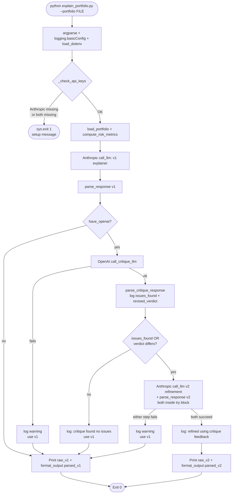

# Task 3 — AI-Powered Portfolio Explainer: Design

**Status:** Approved 2026-05-02
**Source spec:** `task3_explainer/task3_instruction.md` (authoritative — this design is the implementation plan that interprets it)
**Scope:** Base task + bonus 1 (configurable tone, already required by the CLI signature) + bonus 2 (self-critique pass) **redesigned as a hidden refinement loop** — the cross-vendor critique is logged and used to refine the explanation, but never displayed to the user. Bonus 1 is in via the `--tone` flag; the critique → refine flow is how bonus 2 is realized in this design.

**Provider choice:**
- **Primary explainer:** Anthropic Claude (Sonnet 4.5+ — confirm exact model ID via `claude-api` skill at implementation time).
- **Critique reviewer:** OpenAI `gpt-4o`. Cross-vendor by design — gives genuine independent assessment, not a model echoing its own reasoning.
- **Refinement (v2):** Anthropic again, with the OpenAI critique injected as feedback.

**Key UX decisions:**
- The critique is internal — only its effect (the refined v2) is displayed.
- If `OPENAI_API_KEY` is missing or the critique call fails, the script falls back to v1 silently (logs the reason to stderr).
- If `ANTHROPIC_API_KEY` is missing, the script exits 1 with a clear setup message — primary explanation has no value without it.
- If both keys are missing, single combined setup message + exit 1.

---

## 1. Architecture & file layout

```
task3_explainer/
├── explain_portfolio.py                        # ~280-320 lines
├── test_explain_portfolio.py                   # ~120 lines, mocked SDKs
├── prompts/
│   ├── explainer.txt                           # production v1 prompt loaded at runtime
│   ├── critique.txt                            # OpenAI critique prompt loaded at runtime
│   ├── refine.txt                              # Anthropic re-prompt with critique as input
│   └── iteration_log/                          # grader-facing prompt history (NOT loaded by code)
│       ├── explainer_v1.txt                    # naive first attempt
│       ├── explainer_v2.txt                    # added enum constraint
│       └── explainer_v3.txt                    # added example block (== explainer.txt)
├── sample_portfolio.json                       # aggressive — same as Task 1's example
├── sample_portfolio_conservative.json          # 95% cash → expected verdict Conservative
└── README.md                                   # task-specific: summary, run, prompt-iteration log, AI usage

# Repo root (modified)
requirements.txt                                # appended: anthropic, openai, python-dotenv
.env.example                                    # committed template with both keys
.gitignore                                      # already excludes .env (no change needed)
README.md                                       # update Task 3 link from "(TBD)" to per-task README
```

`explain_portfolio.py` top-to-bottom order:

1. Module docstring (1 line) + `from __future__ import annotations`
2. Imports — stdlib (`argparse`, `json`, `logging`, `os`, `sys`), `string.Template`, `pathlib.Path`, `dotenv.load_dotenv`. Anthropic + OpenAI SDKs are imported lazily inside the call functions (faster `--help`, lets `dotenv` load before SDK init).
3. **`sys.path` insertion + Task 1 import**:
   ```python
   sys.path.insert(0, str(Path(__file__).parent.parent / "task1_risk"))
   from risk import compute_risk_metrics  # noqa: E402
   ```
4. Module constants:
   - `DEFAULT_ANTHROPIC_MODEL = "claude-sonnet-4-6"` (confirmed via claude-api skill — current latest Sonnet, 1M context, 64K output)
   - `DEFAULT_OPENAI_CRITIQUE_MODEL = "gpt-4o"`
   - `VALID_VERDICTS = {"Aggressive", "Balanced", "Conservative"}`
   - `VALID_TONES = ("beginner", "experienced", "expert")`
   - `PROMPTS_DIR = Path(__file__).parent / "prompts"`
5. `load_portfolio(path: str) -> dict`
6. `build_explainer_prompt(portfolio, metrics, tone="beginner") -> str`
7. `build_critique_prompt(portfolio, metrics, primary_response) -> str`
8. `build_refine_prompt(portfolio, metrics, previous_response, critique, tone="beginner") -> str`
9. `call_llm(prompt, model) -> str` — Anthropic primary (and refine)
10. `call_critique_llm(prompt, model) -> str` — OpenAI critique
11. `parse_response(raw: str) -> dict` — primary 4-key schema with verdict enum
12. `parse_critique_response(raw: str) -> dict` — critique 2-key schema
13. `format_output(parsed: dict) -> str` — pretty user-facing output (critique never appears here)
14. `_check_api_keys() -> tuple[bool, bool]` — returns `(have_anthropic, have_openai)`; exits 1 if Anthropic missing or both missing
15. `main() -> None` — argparse → dotenv → key check → load → metrics → v1 call → critique (logged) → refine if needed → format → print
16. `if __name__ == "__main__": main()`

**No `__init__.py`** — script-style, sibling import in tests like Tasks 1 and 2.

## 2. Portfolio loading + metrics

```python
def load_portfolio(path: str) -> dict:
    p = Path(path)
    if not p.exists():
        raise FileNotFoundError(f"portfolio file not found: {path}")
    with p.open() as f:
        try:
            return json.load(f)
        except json.JSONDecodeError as e:
            raise ValueError(f"portfolio file is not valid JSON: {path} — {e}") from e
```

**No schema validation here** — `compute_risk_metrics` already validates and raises `ValueError` on bad shape. Re-validating duplicates Task 1's logic.

Metrics step inside `main()` is one line:
```python
metrics = compute_risk_metrics(portfolio)
```

Errors propagate as-is (already informative — "missing required key: total_value_inr").

## 3. Prompt builders — external `.txt` files + `string.Template`

`string.Template` uses `$var` substitution, avoiding the brace-collision problem that f-strings or `str.format` would have with the JSON example blocks. Stdlib, zero deps.

```python
def build_explainer_prompt(portfolio: dict, metrics: dict, tone: str = "beginner") -> str:
    raw = (PROMPTS_DIR / "explainer.txt").read_text()
    return Template(raw).substitute(
        portfolio_json=json.dumps(portfolio, indent=2),
        metrics_json=json.dumps(metrics, indent=2, default=str),  # default=str handles inf
        tone=tone,
    )


def build_critique_prompt(portfolio: dict, metrics: dict, primary_response: str) -> str:
    raw = (PROMPTS_DIR / "critique.txt").read_text()
    return Template(raw).substitute(
        portfolio_json=json.dumps(portfolio, indent=2),
        metrics_json=json.dumps(metrics, indent=2, default=str),
        primary_response=primary_response,                # raw v1 text, not parsed
    )


def build_refine_prompt(
    portfolio: dict, metrics: dict, previous_response: str, critique: dict, tone: str = "beginner"
) -> str:
    raw = (PROMPTS_DIR / "refine.txt").read_text()
    return Template(raw).substitute(
        portfolio_json=json.dumps(portfolio, indent=2),
        metrics_json=json.dumps(metrics, indent=2, default=str),
        previous_response=previous_response,
        critique_issues="\n".join(f"- {i}" for i in critique["issues_found"])
            or "- (no specific issues, but verdict was challenged)",
        critique_verdict=critique["revised_verdict"],
        tone=tone,
    )
```

**Critical safety details:**
- `Template.substitute` raises `KeyError` if a `$var` in the template has no matching kwarg. Don't use `safe_substitute` — silent placeholder leaks would corrupt the prompt.
- `default=str` in `json.dumps(metrics, ...)` converts `float('inf')` (from Task 1's zero-expenses runway) to `"inf"`. Default `json.dumps` raises on `inf`.
- Re-read on every call (no `@lru_cache`). A run makes ≤2 file reads; caching saves microseconds at the cost of stale-prompt confusion during iteration.
- Missing prompt file → `FileNotFoundError` propagates with the path. Clear enough; no wrapper.
- `iteration_log/` files are pure text snapshots with `$var` placeholders raw — they're documentation, never loaded.

### `prompts/explainer.txt` (sketch — full template per spec section "Prompt Structure")

```
You are a friendly but honest financial advisor speaking with an Indian high-net-worth client.
Your tone should be warm, direct, and free of jargon. Speak as if you are sitting across from
the client at a coffee table, not writing a regulatory document.

<portfolio>
$portfolio_json
</portfolio>

<computed_risk_metrics>
$metrics_json
</computed_risk_metrics>

<task>
Analyse the portfolio above. Use the pre-computed metrics — do not recompute them yourself,
as you may make arithmetic errors. Produce a JSON response with exactly these four fields:
- "summary": 3 to 4 sentences explaining the overall risk level in plain English.
- "doing_well": One specific positive observation about the portfolio.
- "should_change": One specific concrete change to consider, with the reasoning.
- "verdict": Exactly one of "Aggressive", "Balanced", or "Conservative".
</task>

<rules>
- Output ONLY valid JSON. No markdown, no code fences, no preamble.
- Verdict must be exactly one of the three allowed values, case-sensitive.
- Reference specific numbers from the portfolio in your summary.
- Keep the language at a $tone level — see definitions below.
- Do not invent data not present in the portfolio.
- Use INR as the currency in all financial references (Crore, Lakh acceptable).
</rules>

<tone_definitions>
- beginner: simple words, no jargon, analogies welcome
- experienced: assume familiarity with terms like "allocation", "drawdown", "rebalancing"
- expert: concise, use precise financial terminology, no hand-holding
</tone_definitions>

<example_output>
{
  "summary": "Your portfolio is leaning aggressive — 30% in BTC means a major crash could halve your wealth overnight...",
  "doing_well": "You have meaningful diversification across crypto, equities, gold, and cash.",
  "should_change": "Consider trimming BTC from 30% to 15-20%. A single asset with -80% downside concentrates too much tail risk.",
  "verdict": "Aggressive"
}
</example_output>
```

### `prompts/critique.txt` (sketch)

```
A junior analyst produced the following portfolio explanation:

<original_explanation>
$primary_response
</original_explanation>

Given the actual portfolio data:

<portfolio>
$portfolio_json
</portfolio>

<computed_metrics>
$metrics_json
</computed_metrics>

Critique the explanation. Are any numbers wrong? Are any major risks missed?
Is the verdict justified?

<rules>
- Output ONLY valid JSON. No markdown, no code fences, no preamble.
- Required fields: "issues_found" (list of strings; empty list if no issues),
  "revised_verdict" (string; if you agree with the original verdict, repeat it).
- The revised_verdict must be exactly one of "Aggressive", "Balanced", or "Conservative".
</rules>

<example_output>
{
  "issues_found": [
    "The summary says runway is 71 months but the metrics show 71.25 — minor rounding, acceptable.",
    "The recommendation to trim BTC doesn't address the 40% NIFTY concentration which is at the spec's warning threshold."
  ],
  "revised_verdict": "Aggressive"
}
</example_output>
```

### `prompts/refine.txt` (sketch)

```
You are a friendly but honest financial advisor speaking with an Indian high-net-worth client.
Your tone should be warm, direct, and free of jargon.

<portfolio>
$portfolio_json
</portfolio>

<computed_risk_metrics>
$metrics_json
</computed_risk_metrics>

<previous_attempt>
$previous_response
</previous_attempt>

<reviewer_critique>
An independent reviewer raised these concerns:
$critique_issues

The reviewer's suggested verdict: $critique_verdict
</reviewer_critique>

<task>
Produce a REVISED explanation that addresses the critique's concerns. Output JSON
with the same four fields: summary, doing_well, should_change, verdict.

If you disagree with the reviewer, you may keep your original conclusion — but
you must explicitly address the specific points they raised.
</task>

<rules>
[same as explainer.txt]
</rules>

<tone_definitions>
[same as explainer.txt]
</tone_definitions>

<example_output>
[same 4-key example as explainer.txt]
</example_output>
```

## 4. LLM client calls + key check

### `call_llm(prompt: str, model: str) -> str` — Anthropic (primary + refine)

```python
def call_llm(prompt: str, model: str) -> str:
    """Call Anthropic; return raw response text. Raises on any failure."""
    from anthropic import Anthropic                                # lazy import
    client = Anthropic()                                            # reads ANTHROPIC_API_KEY from env
    response = client.messages.create(
        model=model,
        max_tokens=1024,
        messages=[{"role": "user", "content": prompt}],
    )
    return response.content[0].text
```

- No try/except — Anthropic failures propagate to `main()` (fail-loud policy).
- `max_tokens=1024` is generous for ~150-token JSON output.
- Reused for v1 explainer call AND the v2 refinement call.

### `call_critique_llm(prompt: str, model: str) -> str` — OpenAI

```python
def call_critique_llm(prompt: str, model: str) -> str:
    """Call OpenAI; return raw response text. Raises on any failure (caller catches)."""
    from openai import OpenAI                                       # lazy import
    client = OpenAI()                                               # reads OPENAI_API_KEY from env
    response = client.chat.completions.create(
        model=model,
        messages=[{"role": "user", "content": prompt}],
        response_format={"type": "json_object"},                    # forces valid JSON
    )
    return response.choices[0].message.content
```

- `response_format={"type": "json_object"}` eliminates the markdown-fence failure mode entirely. We still validate schema in `parse_critique_response` as belt-and-suspenders.
- Caller (`main()`) wraps in try/except — fail-quiet policy.

### `_check_api_keys() -> tuple[bool, bool]`

```python
def _check_api_keys() -> tuple[bool, bool]:
    """Verify env vars are set. Exits 1 if Anthropic missing or both missing."""
    have_anthropic = bool(os.environ.get("ANTHROPIC_API_KEY"))
    have_openai = bool(os.environ.get("OPENAI_API_KEY"))

    if not have_anthropic and not have_openai:
        print(
            "ERROR: Both ANTHROPIC_API_KEY and OPENAI_API_KEY are missing.\n"
            "Setup: cp .env.example .env, then fill in both keys.\n"
            "  - ANTHROPIC_API_KEY: required for the primary explanation\n"
            "  - OPENAI_API_KEY:    optional, used internally for critique-driven refinement\n"
            "Get keys: https://console.anthropic.com/ and https://platform.openai.com/api-keys",
            file=sys.stderr,
        )
        sys.exit(1)

    if not have_anthropic:
        print(
            "ERROR: ANTHROPIC_API_KEY is not set. Set it in .env or your shell.\n"
            "  export ANTHROPIC_API_KEY=sk-ant-...\n"
            "Get a key: https://console.anthropic.com/",
            file=sys.stderr,
        )
        sys.exit(1)

    if not have_openai:
        # Not fatal — log and let main() skip the critique/refine loop.
        print(
            "NOTE: OPENAI_API_KEY not set — critique + refinement will be skipped.",
            file=sys.stderr,
        )

    return have_anthropic, have_openai
```

## 5. Response parsing + output formatting

### `parse_response(raw: str) -> dict` — primary 4-key schema

```python
def parse_response(raw: str) -> dict:
    cleaned = raw.strip()
    if cleaned.startswith("```"):
        cleaned = cleaned.split("```", 2)[1]
        if cleaned.startswith("json"):
            cleaned = cleaned[4:]
        cleaned = cleaned.strip()
    if cleaned.endswith("```"):
        cleaned = cleaned.rsplit("```", 1)[0].strip()

    try:
        parsed = json.loads(cleaned)
    except json.JSONDecodeError as e:
        raise ValueError(f"LLM response is not valid JSON: {e}\n--- raw response ---\n{raw}") from e

    required = {"summary", "doing_well", "should_change", "verdict"}
    missing = required - parsed.keys()
    if missing:
        raise ValueError(f"LLM response missing required keys: {sorted(missing)}\n--- raw response ---\n{raw}")
    if parsed["verdict"] not in VALID_VERDICTS:
        raise ValueError(
            f"verdict must be one of {sorted(VALID_VERDICTS)}, got {parsed['verdict']!r}\n"
            f"--- raw response ---\n{raw}"
        )
    return parsed
```

### `parse_critique_response(raw: str) -> dict` — critique 2-key schema

Same fence-stripping pattern (defense-in-depth, even though `json_object` mode should prevent fences). Validates `issues_found` is a list and `revised_verdict` is in `VALID_VERDICTS`.

### `format_output(parsed: dict) -> str`

**Critique never appears in this output** — that's the redesign:

```python
def format_output(parsed: dict) -> str:
    sep = "═" * 60
    return "\n".join([
        sep, "PARSED OUTPUT", sep, "",
        "Summary:",       f"  {parsed['summary']}", "",
        "Doing Well:",    f"  {parsed['doing_well']}", "",
        "Should Change:", f"  {parsed['should_change']}", "",
        f"Verdict: {parsed['verdict']}",
    ])
```

The RAW LLM response section (also required by spec) is constructed in `main()`, not here — keeps `format_output` pure (no I/O, no critique handling).

## 6. `main()` orchestration with refinement loop

```python
def main() -> None:
    parser = argparse.ArgumentParser(description="Generate plain-English portfolio risk explanation.")
    parser.add_argument("--portfolio", required=True, help="path to portfolio JSON file")
    parser.add_argument("--tone", choices=VALID_TONES, default="beginner")
    parser.add_argument("--model", default=DEFAULT_ANTHROPIC_MODEL, help="Anthropic model ID")
    args = parser.parse_args()

    logging.basicConfig(level=logging.INFO, format="%(asctime)s [%(levelname)s] %(message)s")
    load_dotenv()
    have_anthropic, have_openai = _check_api_keys()

    portfolio = load_portfolio(args.portfolio)
    metrics = compute_risk_metrics(portfolio)

    # v1: primary explanation (fail loud on Anthropic errors)
    prompt_v1 = build_explainer_prompt(portfolio, metrics, args.tone)
    raw_v1 = call_llm(prompt_v1, args.model)
    parsed_v1 = parse_response(raw_v1)

    # Refinement loop (gated on OpenAI availability, fail-quiet on errors)
    final_raw, final_parsed = raw_v1, parsed_v1
    if have_openai:
        critique_prompt = build_critique_prompt(portfolio, metrics, raw_v1)
        try:
            critique_raw = call_critique_llm(critique_prompt, DEFAULT_OPENAI_CRITIQUE_MODEL)
            critique = parse_critique_response(critique_raw)
            logging.info(f"critique issues_found: {critique['issues_found']}")
            logging.info(f"critique revised_verdict: {critique['revised_verdict']}")

            needs_refine = (
                bool(critique["issues_found"])
                or critique["revised_verdict"] != parsed_v1["verdict"]
            )
            if needs_refine:
                try:
                    refine_prompt = build_refine_prompt(portfolio, metrics, raw_v1, critique, args.tone)
                    raw_v2 = call_llm(refine_prompt, args.model)
                    parsed_v2 = parse_response(raw_v2)
                    final_raw, final_parsed = raw_v2, parsed_v2
                    logging.info("explanation refined using critique feedback")
                except Exception as e:
                    logging.warning(f"refinement call failed, falling back to v1: {e}", exc_info=True)
            else:
                logging.info("critique found no issues; v1 used as final")
        except Exception as e:
            logging.warning(f"critique unavailable, no refinement applied: {e}", exc_info=True)

    # Output: ONLY the final (possibly-refined) explanation
    sep = "═" * 60
    print(sep); print("RAW LLM RESPONSE"); print(sep); print(final_raw); print()
    print(format_output(final_parsed))
```

### Refinement-decision matrix

| `issues_found` | `revised_verdict` vs `v1.verdict` | Refine? | Rationale |
|---|---|---|---|
| empty `[]` | same | **No** | Full agreement — v1 is final |
| empty `[]` | different | **Yes** | Verdict disagreement is itself an issue |
| has any items | same | **Yes** | Address the listed issues |
| has any items | different | **Yes** | Both kinds of disagreement |

### Failure semantics

| Failure point | Behavior |
|---|---|
| `ANTHROPIC_API_KEY` missing | `_check_api_keys` exits 1 with setup message |
| `OPENAI_API_KEY` missing | `_check_api_keys` logs warning; main skips critique loop entirely |
| Both keys missing | Combined startup error, exits 1 |
| Anthropic call fails (v1) | Exception propagates, exits non-zero |
| OpenAI critique call fails | Caught; logged; v1 used as final |
| Refinement call fails (v2) | Caught; logged; v1 used as final |
| Bad portfolio JSON | `ValueError` from `load_portfolio` propagates; clear file path in message |
| Portfolio fails Task 1 validation | `ValueError` from `compute_risk_metrics` propagates as-is |
| LLM returns malformed JSON | `parse_response` raises `ValueError` with raw response in message |
| LLM returns invalid verdict enum | `parse_response` raises `ValueError` listing valid set |

### Cost note

Worst case: 2 Anthropic calls (v1 + refine) + 1 OpenAI call per run. At Sonnet 4.5 prices and ~1.5k in / 250 out per call, that's ~$0.015 per run. Negligible for a CLI tool but worth flagging because the refinement doubles the primary-vendor call count.

### Code flow diagram



## 7. Test plan — `test_explain_portfolio.py`

Stdlib + `unittest.mock`, plain `assert`. Sibling import like Tasks 1 and 2. Mocks both LLM SDKs — no live API calls.

**Imports:**
```python
import json
import sys
import tempfile
from pathlib import Path
from unittest.mock import patch, MagicMock

sys.path.insert(0, str(Path(__file__).parent))
from explain_portfolio import (
    load_portfolio,
    build_explainer_prompt,
    build_critique_prompt,
    build_refine_prompt,
    parse_response,
    parse_critique_response,
    format_output,
    VALID_VERDICTS,
)
```

**Tests (8, deterministic only):**

| # | Name | What it covers |
|---|---|---|
| 1 | `test_load_portfolio_valid_file` | Tempfile with sample dict, round-trips correctly |
| 2 | `test_load_portfolio_missing_file` | Nonexistent path → `FileNotFoundError` mentioning path |
| 3 | `test_load_portfolio_bad_json` | Garbage JSON → `ValueError` mentioning file path |
| 4 | `test_build_explainer_prompt_substitutes_tone` | `tone="expert"` → output contains `"expert"`, no unsubstituted `$tone` |
| 5 | `test_parse_response_strips_fences` | ```` ```json\n{...}\n``` ```` → parses correctly |
| 6 | `test_parse_response_rejects_bad_verdict` | `verdict="moderate"` → `ValueError` mentioning the value and valid set |
| 7 | `test_parse_critique_response_validates_revised_verdict` | `revised_verdict="high"` → `ValueError` |
| 8 | `test_format_output_no_critique_section` | Verifies `format_output(parsed)` does NOT contain the word `CRITIQUE` (proves the redesign — critique never appears in user output) |

**What the tests deliberately do NOT cover:**
- Live LLM calls — would need recorded fixtures or live keys; manual acceptance handles.
- Full `main()` orchestration — would require mocking SDKs + argparse + dotenv; per-function tests cover the pieces.
- The refinement decision logic in `main()` — verified via manual run with a portfolio that triggers refinement (acceptance test 1 below).
- Logging output — implementation detail, not contract.

## 8. Workflow, README, and how this lands in git

### Branching & commit sequence — same as Tasks 1 and 2

1. From clean `main` (currently `2f06e35`): `git checkout -b task3/explainer`
2. Implement → test → write per-task README → commit on the branch.
3. Push, open PR, ask user for review.
4. On approval: `gh pr merge 3 --merge --delete-branch`, then `git fetch --prune` locally.

**Two commits on the feature branch:**
- `task3: implement LLM portfolio explainer with cross-vendor critique → refine loop` (`explain_portfolio.py` + `test_explain_portfolio.py` + `prompts/` + sample portfolios + `requirements.txt` update + `.env.example` + spec + plan)
- `task3: add per-task README and update root README link`

### `requirements.txt` additions

```
anthropic>=0.40.0
openai>=1.50.0
python-dotenv>=1.0.0
```

### `.env.example` (committed)

```
# Anthropic (required) — primary LLM for portfolio explanation + refinement
# Get a key: https://console.anthropic.com/
ANTHROPIC_API_KEY=

# OpenAI (optional) — secondary LLM for cross-vendor critique pass
# Used internally to refine the explanation; never displayed to the user
# Get a key: https://platform.openai.com/api-keys
# Leave blank to skip critique + refinement (script still runs end-to-end)
OPENAI_API_KEY=
```

### Sample portfolio files (committed)

- `task3_explainer/sample_portfolio.json` — aggressive (Task 1's example): BTC 30 / NIFTY 40 / GOLD 20 / CASH 10, ₹1Cr total, ₹80k/month expenses.
- `task3_explainer/sample_portfolio_conservative.json` — 95% cash, 5% gold (proves the verdict varies per spec acceptance test 2).

### `task3_explainer/README.md` outline

- **Summary** (3-4 sentences): what the script does, dual-vendor flow at a glance.
- **Run:** setup (`cp .env.example .env`), then `python ... --portfolio sample_portfolio.json`.
- **Acceptance tests** (manual checks per spec section 8 below).
- **Provider chosen + why:** Anthropic primary because it's the Timecell stack; OpenAI critique because cross-vendor sanity check is more honest than self-critique.
- **Prompt iteration log:** narrative pointing at `prompts/iteration_log/` diffs (V1 → V2 → V3 with what failed and what fixed it).
- **Why pre-compute metrics:** brief paragraph on letting Task 1's deterministic math do the calculation, LLM does narration.
- **What didn't work:** honest notes (e.g., tried system prompt + user message split for explainer, didn't notice meaningful improvement, simplified to single user message).
- **AI tool usage:** filled retrospectively after implementation.

### Verification before requesting PR review

1. `cp .env.example .env`, fill in both keys, then `python task3_explainer/explain_portfolio.py --portfolio task3_explainer/sample_portfolio.json` — runs end-to-end; verdict is in `VALID_VERDICTS`; INFO logs show critique findings + whether refinement happened.
2. `python task3_explainer/explain_portfolio.py --portfolio task3_explainer/sample_portfolio_conservative.json` — verdict is `Conservative` (spec acceptance test 2 — proves no hardcoding).
3. `python task3_explainer/explain_portfolio.py --portfolio task3_explainer/sample_portfolio.json --tone expert` — output uses more financial terminology (manual eyeball, spec acceptance test 3).
4. Run the same portfolio 3 times — verdict consistent across runs (spec acceptance test 6).
5. `unset OPENAI_API_KEY && python ...` — script runs successfully, log says critique skipped, output has no critique section.
6. `unset ANTHROPIC_API_KEY && python ...` — exits 1 with setup message (spec acceptance test 5).
7. Bad portfolio JSON file — clear error mentioning the path (spec acceptance test 4).
8. `python task3_explainer/test_explain_portfolio.py` — 8/8 tests pass.

### Out of scope for this PR

- Live happy-path automated tests — would need recorded fixtures (`vcrpy`/`responses`).
- Streaming responses (Anthropic SDK supports `stream=True`).
- LLM response caching (could prompt-hash → response, but this is a one-shot tool).
- Web UI / interactive mode — CLI only per spec.
- Any changes to `task1_risk/`, `task2_market/`, `task4_open/`.
